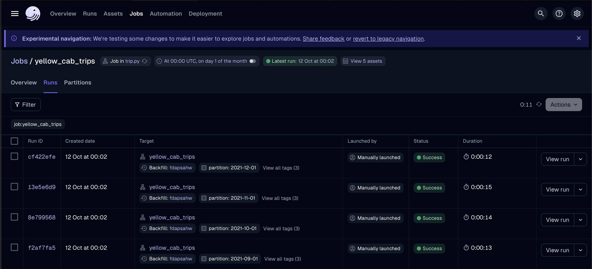
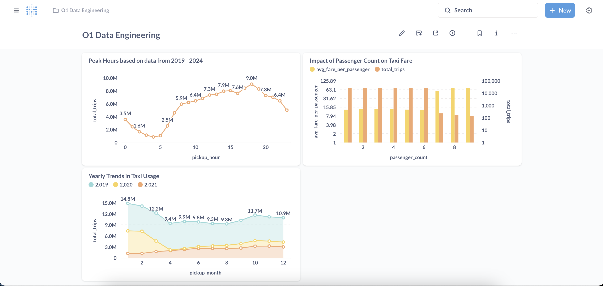

# New York Taxi Data Processing Pipeline

## Project Overview

This project implements a data pipeline for processing New York Taxi Trip data. The goal is to efficiently download, clean, transform, and store data for analysis using modern data engineering tools. The pipeline uses Dagster for scheduling and orchestrating jobs, Pandas for data cleaning and transformation, SQLite for data storage, and Metabase for running queries and visualizing the results.

The data is partitioned by month, starting from January 2019. Instead of storing raw data, the pipeline aggregates it to generate insights, such as peak taxi usage hours and trends in fare based on trip duration.

## Tools Used
- **Dagster**: To schedule and manage the data pipeline jobs.
- **Pandas**: For data cleaning and transformation.
- **SQLite**: To store the processed and aggregated data.
- **Metabase**: To run queries and visualize the results.
  
## Project Setup

### Prerequisites
- Docker is required for running both Dagster and Metabase

### Running Project
- Simply use ```make``` command when running it for the first time. This command will do following:
This will do following:
    - Download the necessary assets from google drive and unzip it
    - Set up the Dagster and Metabase environments by calling ```docker compose up -d```
- For all subsequent times ```make start``` command can be used which only call ```docker compose up -d``` to setup Dagster and Metabase
- For shutting down the services just run ```make stop``` command which runs ```docker compose down``` and create a zip file of the assets.

**Access Dagster:** Once the setup is complete, visit ```http://localhost:3000``` to access the Dagster UI. From there, you can manually trigger jobs for any specific month

**Access Metabase:** After the data is processed and stored, you can explore and visualize the results using Metabase. Navigate to ```http://localhost:5000``` to see the dashboard and run queries.

### Data Pipeline Workflow:
- **Data Downloading:** The pipeline automatically downloads New York taxi data starting from January 2019.
- **Data Cleaning:** The downloaded data is cleaned using Pandas, removing any rows with missing or corrupted data.
- **Data Transformation:** The cleaned data is transformed to derive additional insights, such as:
    - Calculating trip duration and average speed.
    - Aggregating data to calculate total trips and average fare per day.
- **Data Storage:** The aggregated data is stored in an SQLite database, which is optimized for querying the necessary metrics.

### Usage Insturction
1. **Run the Data Pipeline:**
    - Access Dagster at ```http://localhost:3000```.
    - Start the job for any specific month by selecting the appropriate partition (monthly).



2. **View the Dashboard:**
    - Visit ```http://localhost:5000``` to access the Metabase dashboard for visualizations.

